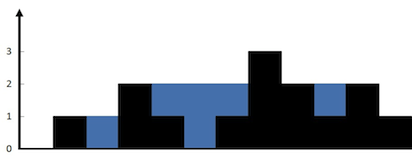

## 42. Trapping Rain Water (Leetcode) - Hard

Given `n` non-negative integers representing an elevation map where the width of each bar is 1, compute how much water it can trap after raining.

[Link for the question](https://leetcode.com/problems/trapping-rain-water/description/)

**Example 1:**



> **Input:** `height = [0,1,0,2,1,0,1,3,2,1,2,1]`  
> **Output:** `6`  
> **Explanation:**  
> The above elevation map (black section) is represented by array `[0,1,0,2,1,0,1,3,2,1,2,1]`. In this case, 6 units of rain water (blue section) are being trapped.

**Example 2:**

> **Input:** `height = [4,2,0,3,2,5]`  
> **Output:** `9`

**Constraints:**

- `n == height.length`
- `1 <= n <= 2 * 10^4`
- `0 <= height[i] <= 10^5`

#### Answer

```python
class Solution:
    def trap(self, height: List[int]) -> int:
        left, right = 0, len(height) - 1
        left_max, right_max = height[left], height[right]
        water = 0

        while left < right:
            if left_max < right_max:
                left += 1
                left_max = max(left_max, height[left])
                water += left_max - height[left]
            else:
                right -= 1
                right_max = max(right_max, height[right])
                water += right_max - height[right]

        return water
```