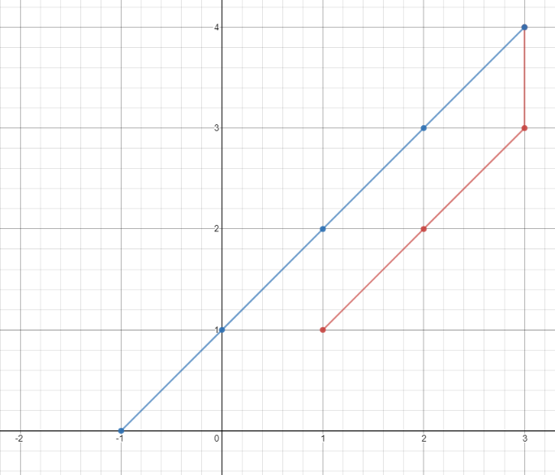

## 1266. Minimum Time Visiting All Points (Leetcode) - Easy

On a 2D plane, there are `n` points with integer coordinates `points[i] = [xi, yi]`. Return the minimum time in seconds to visit all the points in the order given by `points`.

You can move according to these rules:

In 1 second, you can either:

- move vertically by one unit,
- move horizontally by one unit, or
- move diagonally `sqrt(2)` units (in other words, move one unit vertically then one unit horizontally in 1 second).

You have to visit the points in the same order as they appear in the array.
You are allowed to pass through points that appear later in the order, but these do not count as visits.

[Link for the question](https://leetcode.com/problems/minimum-time-visiting-all-points/description/)

**Example 1:**



> **Input:** `points = [[1,1],[3,4],[-1,0]]`  
> **Output:** `7`  
> **Explanation:**  
> One optimal path is `[1,1] -> [2,2] -> [3,3] -> [3,4] -> [2,3] -> [1,2] -> [0,1] -> [-1,0]`  
> Time from `[1,1]` to `[3,4]` = 3 seconds  
> Time from `[3,4]` to `[-1,0]` = 4 seconds  
> Total time = 7 seconds

**Example 2:**

> **Input:** `points = [[3,2],[-2,2]]`  
> **Output:** `5`

**Constraints:**

- `points.length == n`
- `1 <= n <= 100`
- `points[i].length == 2`
- `-1000 <= points[i][0], points[i][1] <= 1000`

#### Answer
```Python
class Solution:
    def minTimeToVisitAllPoints(self, points: List[List[int]]) -> int:
        result = 0
        x1, y1 = points.pop()

        while points:
            x2, y2 = points.pop()
            result += max(abs(y2 - y1), abs(x2 - x1))
            x1, y1 = x2, y2

        return result
```

# Understanding `pop()` in Python

The `pop()` method removes and returns the **last element** from a list by default, and has a **time complexity of O(1)**.  
If an index is provided like `list.pop(i)`, it removes and returns the element at that index, which takes **O(n)** time in the worst case due to shifting.  
Using `num = list.pop()` stores the last element in `num`, while `x1, x2 = list.pop()` expects the popped item to be an **iterable with exactly two elements**, such as a tuple or list.

## Example:

```python
# Example 1
my_list = [10, 20, 30]
num = my_list.pop()      # num = 30, my_list = [10, 20]

# Example 2
my_list = [(1, 2), (3, 4)]
x1, x2 = my_list.pop()   # x1 = 3, x2 = 4, my_list = [(1, 2)]
```