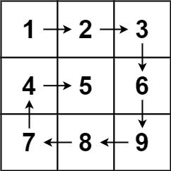

## 54. Spiral Matrix (Leetcode) - Medium

Given an `m x n` matrix, return all elements of the matrix in spiral order.

[Link for the question](https://leetcode.com/problems/spiral-matrix/description/)

**Example 1:**



> **Input:** `matrix = [[1,2,3],[4,5,6],[7,8,9]]`  
> **Output:** `[1,2,3,6,9,8,7,4,5]`

**Example 2:**


> **Input:** `matrix = [[1,2,3,4],[5,6,7,8],[9,10,11,12]]`  
> **Output:** `[1,2,3,4,8,12,11,10,9,5,6,7]`

**Constraints:**

- `m == matrix.length`
- `n == matrix[i].length`
- `1 <= m, n <= 10`
- `-100 <= matrix[i][j] <= 100`

#### Answer
```Python
class Solution:
    def spiralOrder(self, matrix: List[List[int]]) -> List[int]:
        result = []
        left = top = 0
        right = len(matrix[0])
        bottom = len(matrix)

        while left < right and top < bottom:
            for i in range(left, right):
                result.append(matrix[top][i])
            top += 1

            for i in range(top, bottom):
                result.append(matrix[i][right - 1])
            right -= 1

            if not (left < right and top < bottom):
                break

            for i in range(right - 1, left - 1, - 1):
                result.append(matrix[bottom - 1][i])
            bottom -= 1

            for i in range(bottom - 1, top - 1, -1):
                result.append(matrix[i][left])
            left += 1

        return result
```