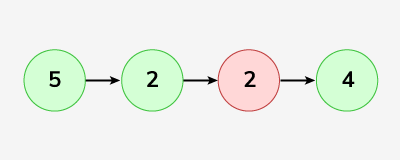

# Remove Duplicates from an Unsorted Linked List (GeeksforGeeks) - Easy

Given an unsorted linked list. The task is to remove duplicate elements from this unsorted Linked List. When a value appears in multiple nodes, the node which appeared first should be kept, all other duplicates are to be removed.

[Link for the question](https://www.geeksforgeeks.org/problems/remove-duplicates-from-an-unsorted-linked-list/1)

## Examples

**Example 1:**

> **Input:** `LinkedList: 5->2->2->4` > **Output:** `5->2->4` > **Explanation:** Given linked list elements are `5->2->2->4`, in which `2` is repeated only. So, we will delete the extra repeated elements `2` from the linked list and the resultant linked list will contain `5->2->4`.
> 

**Example 2:**

> **Input:** `LinkedList: 2->2->2->2->2` > **Output:** `2` > **Explanation:** Given linked list elements are `2->2->2->2->2`, in which `2` is repeated. So, we will delete the extra repeated elements `2` from the linked list and the resultant linked list will contain only `2`.

## Time and Space Complexity

- **Expected Time Complexity:** `O(n)`
- **Expected Space Complexity:** `O(n)`

## Constraints

- `1 <= number of nodes <= 10^6`
- `0 <= node->data <= 10^6`

```Python
class Solution:
    def removeDuplicates(self, head):
        if not head:
            return head

        seen = set()
        seen.add(head.data)
        current = head

        while current.next:
            if current.next.data in seen:
                current.next = current.next.next
            else:
                seen.add(current.next.data)
                current = current.next

        return head
```
