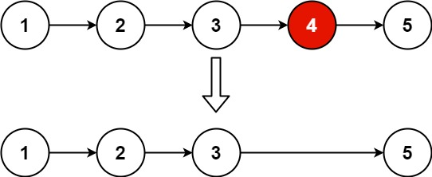

# 19. Remove Nth Node From End of List (LeetCode) - Medium

Given the `head` of a linked list, remove the `nth` node from the end of the list and return its `head`.

[Link for the question](https://leetcode.com/problems/remove-nth-node-from-end-of-list/)

**Example 1:**



> **Input:** `head = [1,2,3,4,5]`, `n = 2`  
> **Output:** `[1,2,3,5]`

**Example 2:**

> **Input:** `head = [1]`, `n = 1`  
> **Output:** `[]`

**Example 3:**

> **Input:** `head = [1,2]`, `n = 1`  
> **Output:** `[1]`

**Constraints:**

- The number of nodes in the list is `sz`.
- `1 <= sz <= 30`
- `0 <= Node.val <= 100`
- `1 <= n <= sz`

```Python
class Solution:
    def removeNthFromEnd(self, head: Optional[ListNode], n: int) -> Optional[ListNode]:
        dummy = ListNode(0, head)
        left, right = dummy, head

        
        while n > 0 and right:
            right = right.next
            n -= 1

        while right:
            left = left.next
            right = right.next

        left.next = left.next.next

        return dummy.next
```