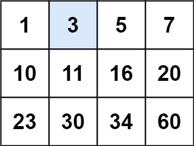

m == matrix.length

# 74. Search a 2D Matrix (LeetCode) - Medium

You are given an `m x n` integer matrix `matrix` with the following two properties:

- Each row is sorted in non-decreasing order.
- The first integer of each row is greater than the last integer of the previous row.

Given an integer `target`, return `true` if `target` is in `matrix` or `false` otherwise.

You must write a solution in `O(log(m * n))` time complexity.

[Link for the question](https://leetcode.com/problems/search-a-2d-matrix/)

## Examples

**Example 1:**



> **Input:** `matrix = [[1,3,5,7],[10,11,16,20],[23,30,34,60]]`, `target = 3` > **Output:** `true`

**Example 2:**


> **Input:** `matrix = [[1,3,5,7],[10,11,16,20],[23,30,34,60]]`, `target = 13` > **Output:** `false`

## Constraints

- `m == matrix.length`
- `n == matrix[i].length`
- `1 <= m, n <= 100`
- `-10^4 <= matrix[i][j], target <= 10^4`

```python
class Solution:
    def searchMatrix(self, matrix: List[List[int]], target: int) -> bool:
        if not matrix or not matrix[0]:
            return False

        rows = len(matrix)
        cols = len(matrix[0])

        left = 0
        right = (rows * cols) - 1

        while left <= right:
            mid = (left + right) // 2

            row = mid // cols
            col = mid % cols
            mid_val = matrix[row][col]

            if mid_val == target:
                return True
            elif mid_val < target:
                left = mid + 1
            else:
                right = mid - 1

        return False
```
