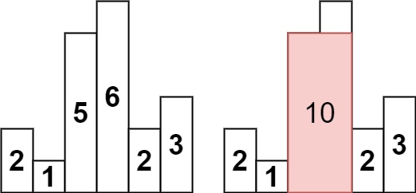
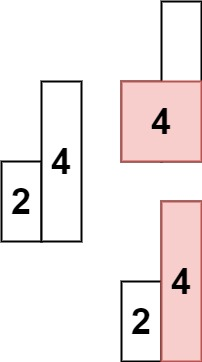

# 84. Largest Rectangle in Histogram (LeetCode) - Hard

Given an array of integers `heights` representing the histogram's bar height where the width of each bar is `1`, return the area of the largest rectangle in the histogram.

[Link for the question](https://leetcode.com/problems/largest-rectangle-in-histogram/)

## Examples

**Example 1:**



> **Input:** `heights = [2,1,5,6,2,3]` > **Output:** `10` > **Explanation:** The above is a histogram where width of each bar is `1`. The largest rectangle is shown in the red area, which has an area = `10` units.

**Example 2:**



> **Input:** `heights = [2,4]` > **Output:** `4`

## Constraints

- `1 <= heights.length <= 10^5`
- `0 <= heights[i] <= 10^4`

```Python
class Solution:
    def largestRectangleArea(self, heights: List[int]) -> int:
        maxArea = 0
        stack = []

        for i, h in enumerate(heights):
            start = i
            while stack and stack[-1][1] > h:
                index, height = stack.pop()
                maxArea = max(maxArea, height * (i - index))
                start = index
            stack.append((start, h))

        for i, h in stack:
            maxArea = max(maxArea, h * (len(heights) - i))

        return maxArea
```