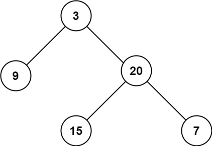

# 104. Maximum Depth of Binary Tree (LeetCode) - Easy

Given the root of a binary tree, return its maximum depth.

A binary tree's maximum depth is the number of nodes along the longest path from the root node down to the farthest leaf node.

[Link for the question](https://leetcode.com/problems/maximum-depth-of-binary-tree/)

## Examples

**Example 1:**



> **Input:** `root = [3,9,20,null,null,15,7]` > **Output:** `3`

**Example 2:**

> **Input:** `root = [1,null,2]` > **Output:** `2`

## Constraints

- The number of nodes in the tree is in the range `[0, 10^4]`.
- `-100 <= Node.val <= 100`

```python
class Solution:
    def maxDepth(self, root: Optional[TreeNode]) -> int:
        if not root:
            return 0

        return 1 + max(self.maxDepth(root.left), self.maxDepth(root.right))
```